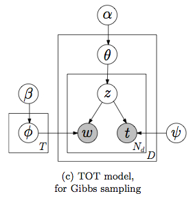
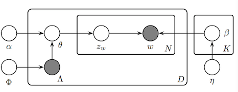

## Topic Modeling:

### [Topic Modeling Bibliography](http://mimno.infosci.cornell.edu/topics.html)
- Dr. Mimno organizes resources on Topic Modeling and labels each paper based on its category. It is awesome! Thanks to him!

### [Latent Dirichlet Allocation](http://www.cs.princeton.edu/~blei/papers/BleiNgJordan2003.pdf)(JMLR03)
- Authors: David M. Blei, Andrew Y. Ng, Michael I. Jordan.
- Summary: This paper presents efficient approximate inference techniques based on variational methods and an EM algorithm for empirical Bayes parameter estimation.

### [Finding Scientific Topics](http://psiexp.ss.uci.edu/research/papers/sciencetopics.pdf)(PNAS04)
- Authors:Thomas L. Griffiths, Mark Steyvers.
- Summary: Using Gibbs Sampling to discover topics in articles.

### [Topics over Time: A Non-Markov Continuous-Time Model of Topical Trends](tot-kdd06.pdf) (ACM SIGKDD06)  
| Graphical Model of TOT |
|:---:|
|  |

<!--

-->
- Authors: Xuerui Wang, Andrew McCallum.
- Summary: A variant of LDA model trying to capture the topical trends. The mixture distribution over topics is influenced by both word co-occurrences and the document’s timestamp. Timestamp for each word is the same with that document. 
- Generative Process: 
  - Draw T multinomials &phi;z from a Dirichlet prior &beta;, one for each topic z;
  - For each document d, draw a multinomial &theta;d from a Dirichlet prior &alpha;, then for each word wdi in document d:
    - Draw a topic zdi from multinomial &theta;d;
    - Draw a word wdi from multinomial &phi;zdi;
    - Draw a timestamp tdi from Beta &psi;zdi;

- They use Gibbs Sampling to perform approximate inference and evaluate their model on 3 dataset: NIPS papers(17 years: 1987-2003), A Researcher's Emails(9 months), State-of-the-Union Addresses(21 decades) and compare TOT to LDA. Also, they use topic distributions of documents to predict timestamps. Number of topics T is fixed to be 50. &alpha;=50/T, &beta; = 0.1.

### [Dynamic Topic Models](dtm_icml06.pdf)(ICML06)
- Authors: David M. Blei, John D. Lafferty.

### [Probabilistic Topic Models](http://psiexp.ss.uci.edu/research/papers/SteyversGriffithsLSABookFormatted.pdf)(Handbook of Latent Semantic Analysis07) 
- Authors: Mark Steyvers, Tom Griffiths. 
- Summary: This paper introduces Gibbs Sampling for inference of LDA model.

### [Characterizing Microblogs with Topic Models](twitter-icwsm10.pdf) (ICWSM10)
| Graphical Model of Labeled LDA on Twitter |
|:---:|
|  |

<!--

-->
- Authors: Daniel Ramage, Susan Dumais, Dan Liebling.
- Summary: This paper introduces a way to characterize tweets using topic modeling.
- Generative Process:
  - For each topic k in 1..K, draw a multinomial distribution &beta;k from symmetric Dirichlet prior &eta;.
  - For each tweet d in 1..D:
    - 1. Build a label set &Lambda; describing the tweet from the deterministic prior &Phi;
    - 2. Select a multinomial distribution &theta;d over the labels &Lambda;d from symmetric Dirichlet prior &alpha;.
    - 3. For each word position i 1..N in tweet d. First draw a label zd from label multinomial &theta;d. Then draw a word wdfrom word multinomial &beta;z.

### [Probabilistic Topic Models](http://www.cs.princeton.edu/~blei/papers/Blei2012.pdf)(CACM12)
- Authors: David M. Blei.
- Summary: This paper surveyes probabilistic topic models to provide a statistical solution to manage large archives of documents. It investigated the Latent Dirichlet Allocation model(LDA), the extended versions and future directions for LDA.

### [Modeling Flu on Twitter using Temporal Topic Models]()(ICDM14)
| Graphical Model of HFSTM |
|:---:|
|  |
  
  <!--

-->
  
- Summary: This paper proposes temporal topic models to capture hidden states of a user from his tweets and aggregate states in a geographical region for better estimation of flu trends. They define states of flue and combines the states as a hidden random variable into the temporal topic graphical models. 

