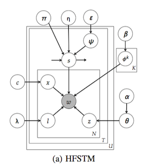

## Topic Modeling:

- [Topics over Time: A Non-Markov Continuous-Time Model of Topical Trends](tot-kdd06.pdf)  

  - Summary: A variant of LDA model trying to capture the topical trends. The mixture distribution over topics is influenced by both word co-occurrences and the document’s timestamp. Timestamp for each word is the same with that document. 
  
  - Draw T multinomials &phi;z from a Dirichlet prior &beta;, one for each topic z;
  - For each document d, draw a multinomial &theta;d from a Dirichlet prior &alpha;, then for each word wdi in document d:
    - Draw a topic zdi from multinomial &theta;d;
    - Draw a word wdi from multinomial &phi;zdi;
    - Draw a timestamp tdi from Beta &psi;zdi;
  - They use Gibbs Sampling to perform approximate inference and evaluate their model on 3 dataset: NIPS papers(17 years: 1987-2003), A Researcher's Emails(9 months), State-of-the-Union Addresses(21 decades) and compare TOT to LDA. Also, they use topic distributions of documents to predict timestamps. Number of topics T is fixed to be 50. &alpha;=50/T, &beta; = 0.1.

- [Modeling Flu on Twitter using Temporal Topic Models]()
  - 
  - Summary: This paper proposes temporal topic models to capture hidden states of a user from his tweets and aggregate states in a geographical region for better estimation of flu trends. They define states of flue and combines the states as a hidden random variable into the temporal topic graphical models. 

- [Characterizing Microblogs with Topic Models](twitter-icwsm10.pdf)
  - Summary: This paper introduces a way to characterize tweets using topic modeling.
  - For each topic k in 1..K, draw a multinomial distribution &beta;k from symmetric Dirichlet prior &eta;.
  - For each tweet d in 1..D:
    - 1. Build a label set &Lambda; describing the tweet from the deterministic prior &Phi;
    - 2. Select a multinomial distribution &theta;d over the labels &Lambda;d from symmetric Dirichlet prior &alpha;.
    - 3. For each word position i 1..N in tweet d. First draw a label zd from label multinomial &theta;d. Then draw a word wdfrom word multinomial &beta;z.
